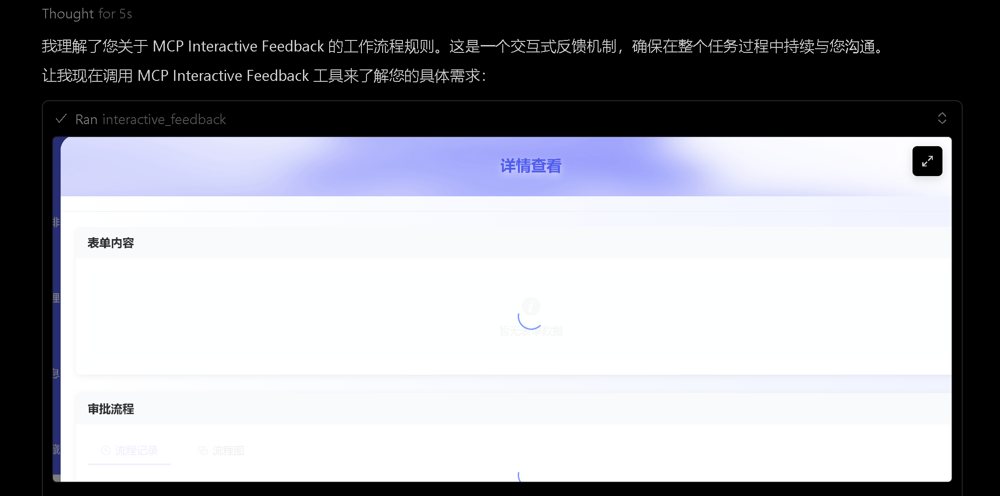
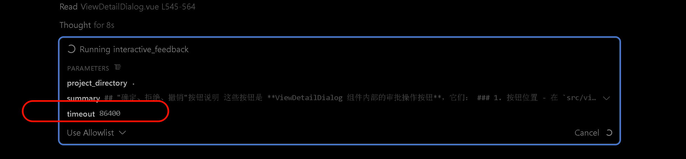

# Cursor Feedback MCP

## 🔧 项目说明

> 基于 [mcp-feedback-enhanced](https://github.com/Minidoracat/mcp-feedback-enhanced) 项目进行定制开发，感谢原作者的贡献！

本版本修复了以下问题并新增功能：

### ✅ 已修复问题

1. **超时设置问题**：修复了超时时间永远是 600s 的问题，现已修复默认 24 小时超时
   ，可以长时间等待反馈啦
2. **图片上传问题**：修复了无法上传图片报错序列号错误的问题，现已支持更多类型图
   片 😁🎉
3. **断网重连功能**：新增断网不断链接功能，现在可以离线同一个会话等待（适合使用
   手机热点为电脑提供互联网的场景）

### 🚀 如何使用

#### 方式一：使用 uvx 直接安装（推荐）

```bash
# 直接使用 uvx 运行
uvx cursor-feedback-mcp

# 或者安装后使用
uv tool install cursor-feedback-mcp
cursor-feedback-mcp
```

#### 方式二：在 Cursor 中配置

```json
{
  "mcpServers": {
    "cursor-feedback-mcp": {
      "command": "uvx",
      "args": ["cursor-feedback-mcp"],
      "timeout": 86400,
      "env": {
        "MCP_DEBUG": "false",
        "MCP_WEB_HOST": "127.0.0.1",
        "MCP_WEB_PORT": "8765",
        "MCP_DESKTOP_MODE": "false",
        "MCP_LANGUAGE": "zh-CN"
      },
      "autoApprove": ["interactive_feedback"]
    }
  }
}
```

#### 方式三：本地开发模式

Fork 本项目到本地，在 Cursor 中配置：

```json
{
  "mcpServers": {
    "cursor-feedback-mcp-local": {
      "command": "uv",
      "args": [
        "run",
        "--directory",
        "/path/to/your/cursor_feedback_mcp",
        "python",
        "-m",
        "cursor_feedback_mcp"
      ],
      "timeout": 86400,
      "env": {
        "MCP_DEBUG": "false",
        "MCP_WEB_HOST": "127.0.0.1",
        "MCP_WEB_PORT": "8765",
        "MCP_DESKTOP_MODE": "false",
        "MCP_LANGUAGE": "zh-CN"
      },
      "autoApprove": ["interactive_feedback"]
    }
  }
}
```

> **注意**：请将 `/path/to/your/cursor_feedback_mcp` 改为您本地的项目位置。

### 📸 界面预览

<div align="center">
  
  <br>
  <em>主界面 - 支持提示管理、自动提交、会话跟踪上传图片等功能</em>
</div>

<div align="center">
  
  <br>
  <em>超时功能展示 - 智能工作流程和现代化体验</em>
</div>

---

## 📦 安装与发布

### 从 PyPI 安装

```bash
# 使用 uvx 直接运行
uvx cursor-feedback-mcp

# 或使用 pip 安装
pip install cursor-feedback-mcp

# 或使用 uv 安装
uv tool install cursor-feedback-mcp
```

### 本地开发

```bash
# 克隆项目
git clone https://github.com/zhajiahe/cursor-feedback-mcp.git
cd cursor-feedback-mcp

# 安装依赖
uv sync

# 运行测试
uv run pytest

# 本地构建
uv build
```

---
